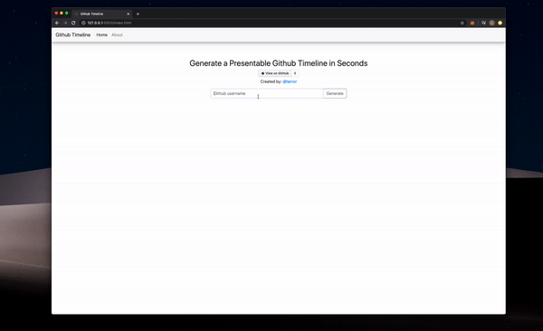

# Github-Timeline

Github Timeline is a simple application that lets users see, given a Github username, the timeline of repositories for that Github Account. 

Live Demo: 

If you enjoyed this application please feel free to give it a star!

Add me on discord: liam#0005 if you'd like to collaborate on a project.

